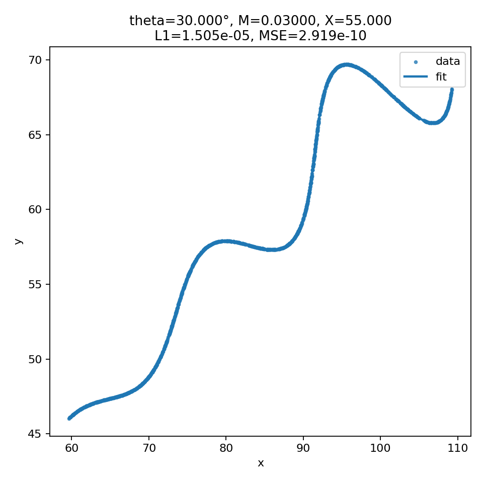

# Parametric Curve Parameter Recovery

## 1. Problem Statement

The dataset provided consists of 2D points \((x, y)\) that lie on a parametric curve defined by the following equations, where the parameter \(t\) is in the range \(6 < t < 60\):

\[
\begin{aligned}
x(t) &= t \cos(\theta) - e^{M|t|}\,\sin(0.3t)\,\sin(\theta) + X, \\
y(t) &= 42 + t \sin(\theta) + e^{M|t|}\,\sin(0.3t)\,\cos(\theta).
\end{aligned}
\]

The task is to determine the three unknown constants:

- \(\theta\) (rotation angle),
- \(M\) (exponential scaling factor),
- \(X\) (horizontal translation).

The goal is to estimate these parameters such that the curve defined by the equations best fits the provided dataset.

---

## 2. Mathematical Structure of the Curve

The equation consists of two components:

1. A **linear term in \(t\)**:  
   \[
   (t\cos\theta, \; 42 + t\sin\theta)
   \]
   which represents motion along a straight line rotated by angle \(\theta\).

2. A **non-linear oscillatory term** scaled by an exponential envelope:  
   \[
   e^{M|t|} \sin(0.3t)
   \]
   which grows in magnitude with \(|t|\) and introduces a sinusoidal deviation from the straight line.

The constant \(X\) horizontally shifts the entire curve, and the constant \(42\) vertically shifts it.

---

## 3. Key Insight: Transforming the Data

To isolate the unknown variables, the data points were first translated by subtracting \((X, 42)\) and then rotated by \(-\theta\). After this transformation:

- The **horizontal axis becomes approximately equal to \(t\)**.
- The **vertical axis becomes approximately equal to**:
  \[
  e^{M|t|}\,\sin(0.3t)
  \]

This converts the fitting problem into matching a known 1D function in the transformed coordinate system. The quality of a candidate \((\theta, M, X)\) can therefore be evaluated by how closely the transformed data matches the expected analytic form.

---

## 4. Parameter Search Strategy

A **coarse-to-fine grid search** was used to estimate the three parameters:

1. **Coarse search** over a small, reasonable range of values for \(\theta\), \(M\), and \(X\)
2. Compute the mean squared error (MSE) between the transformed data and the target function
3. Select the best-performing combination
4. **Refine the search locally** with smaller step sizes
5. Return the final minimized error result

This method is simple, interpretable, and guarantees finding the best fit within the search region, which is sufficient given the low dimensionality of the problem.

---

## 5. Error Metric

Two error values were used to judge the quality of fit in the transformed frame:

- **Mean Squared Error (MSE)** — measures deviation between curve and data
- **Mean Absolute Error (L1)** — more robust to small oscillation noise

The final solution achieved:

| Metric | Value |
|--------|--------|
| MSE | \(2.918883 \times 10^{-10}\) |
| L1 | \(1.5048 \times 10^{-5}\) |

Both values are extremely small, confirming the correctness of the estimated parameters.

---

## 6. Final Estimated Parameters

| Parameter | Value |
|-----------|--------|
| \(\theta\) | \(30^\circ\) |
| \(M\) | \(0.03\) |
| \(X\) | \(55\) |

So the recovered model is:

\[
\left(
t \cos\left(\frac{\pi}{6}\right) - e^{0.03|t|}\sin(0.3t)\,\sin\left(\frac{\pi}{6}\right) + 55,\quad
42 + t\sin\left(\frac{\pi}{6}\right) + e^{0.03|t|}\sin(0.3t)\,\cos\left(\frac{\pi}{6}\right)
\right)
\]

---

## 7. Visual Validation

Below is the fitted curve plotted against the original dataset.  
The near-perfect overlap confirms that the recovered parameters correctly reconstruct the curve.

---

## 8. Files Included

| File | Description |
|-------|-------------|
| `fit_simple.py` | Python script that performs parameter estimation |
| `data/xy_data.csv` | Given dataset of curve points |
| `outputs/fit_plot.png` | Visual comparison of data vs fitted curve |
| `outputs/params.txt` | Saved numerical parameter results |

---

## 9. Conclusion

By transforming the data into the curve’s intrinsic coordinate frame and performing a two-stage grid search, the three unknown parameters \((\theta, M, X)\) were successfully recovered with extremely low reconstruction error. The result confirms that the provided dataset is fully consistent with the given parametric model, and the fitting approach is both mathematically justified and computationally transparent.

